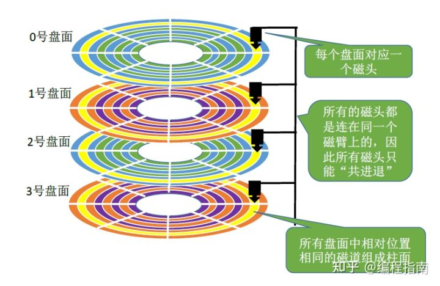

- [file system](#file-system)
  - [disk](#disk)

# file system

## disk

由上，可用（柱面号，盘面号，扇区号）来定位任意一个“磁盘块”。

inode
https://blog.csdn.net/sunshine77_/article/details/120764986
https://github.com/sunym1993/flash-linux0.11-talk